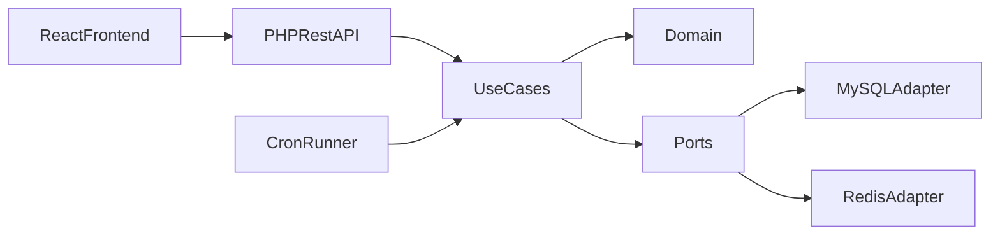

# Architecture

## Context
Gran Study Planner is a full-stack portfolio project aligned with a junior full-stack role requiring PHP, React, TypeScript, REST, cron, MySQL, Redis, Docker, and Gitflow.

## Hexagonal design
- `Domain`: entities, invariants, and ports.
- `Application`: use cases orchestrating business flows.
- `Infrastructure`: adapters for MySQL, Redis, token handling, logging, cron.
- `Interface`: HTTP kernel, request parsing, auth middleware, presenters.

## Data flow

## Key trade-offs
- Plain PHP was chosen to make hexagonal boundaries explicit without framework magic.
- JWT-like local token keeps auth simple for MVP and interview demonstration.
- Redis cache is optional at runtime and falls back safely when unavailable.
