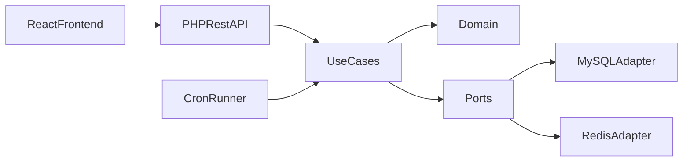

# Architecture

## Context
Gran Study Planner is a full-stack portfolio project aligned with a junior full-stack role requiring PHP, React, TypeScript, REST, cron, MySQL, Redis, Docker, and Gitflow.

**Estado atual (resumo)**:
- Backend hexagonal com `Kernel` HTTP, autenticação por token, cache de dashboard (Redis opcional), rate limiting por usuário/rota, validação de request na camada Interface.
- Metas semanais (`weekly_goals`) e **`GET /weekly-progress`** com contagens por **eventos** na tabela `activity_events` (semana ISO): `created` (bucket pelo `status` inicial), `status_changed` (bucket pelo `to`), `marked_overdue` (bucket `overdue`). Eventos `deleted` são gravados para auditoria e **não** entram nesses totais.
- CI: GitHub Actions roda PHPUnit (somente `tests/Unit` por enquanto) e Vitest + build do frontend.
- **Referências visuais**: pasta local `ref/` (ignorada no Git) com HTML de referência para alinhar telas; não faz parte do build.
- **Fluxo Git**: preferir branches de feature e PRs — ver [contributing.md](contributing.md).

## Hexagonal design
- `Domain`: entities, invariants, and ports.
- `Application`: use cases orchestrating business flows.
- `Infrastructure`: adapters for MySQL, Redis, token handling, logging, cron.
- `Interface`: HTTP kernel, request parsing, auth middleware, presenters.

## Data flow

## Key trade-offs
- Plain PHP was chosen to make hexagonal boundaries explicit without framework magic.
- JWT-like local token keeps auth simple for MVP and interview demonstration.
- Redis cache is optional at runtime and falls back safely when unavailable.
