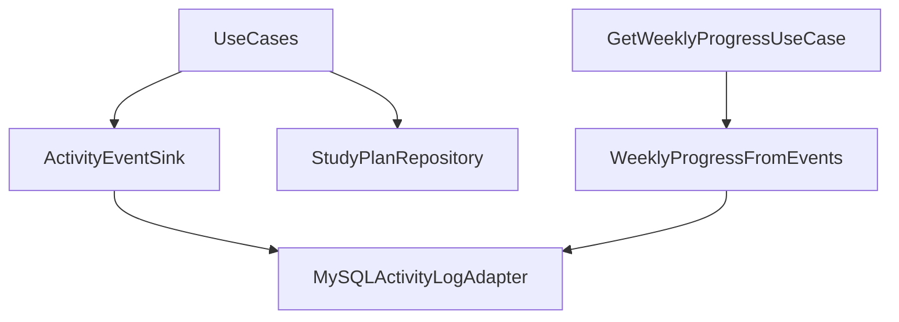

# Plano técnico: Activity event log adapter (próximo passo v0.3.0)

## Objetivo
Registrar eventos de domínio (criação de plano, mudança de status, exclusão, marcação overdue pelo cron, etc.) de forma **append-only**, para:
- substituir o proxy `updated_at` no **progresso semanal** por contagens baseadas em eventos reais;
- habilitar auditoria leve e futuras notificações (roadmap: email/calendar).

## Por que um adapter (hexagonal)
- **Porta no domínio**: `ActivityLogRepositoryInterface` (ou `ActivityEventSink`) com operações do tipo `append(ActivityEvent $event)`.
- **Adapter MySQL**: tabela `activity_events` persistindo JSON ou colunas fixas.
- **Quem chama**: use cases existentes **após** sucesso da operação (ou transação), sem acoplar HTTP.

Isso mantém regras de negócio na Application e troca de storage na Infrastructure.

## Modelo de evento (mínimo viável)
| Campo | Tipo | Descrição |
|--------|------|-----------|
| `id` | UUID/string | PK |
| `user_id` | int | dono do contexto |
| `entity_type` | string | ex.: `study_plan` |
| `entity_id` | string | id do plano |
| `event_type` | string | ex.: `created`, `status_changed`, `deleted`, `marked_overdue` |
| `payload` | JSON opcional | ex.: `{"from":"pending","to":"done"}` |
| `occurred_at` | datetime | quando aconteceu (UTC ou local consistente) |

Índices sugeridos: `(user_id, occurred_at)`, `(entity_type, entity_id, occurred_at)`.

## Onde emitir eventos
- `CreateStudyPlanUseCase` → `created`
- `UpdateStudyPlanStatusUseCase` → `status_changed` (payload com from/to)
- `DeleteStudyPlanUseCase` → `deleted`
- `MarkOverduePlansUseCase` (cron) → `marked_overdue` por plano afetado

**Decisão**: não logar leituras (`GET`) para manter volume baixo.

## Progresso semanal (evolução)
1. Manter endpoint `GET /weekly-progress` com a mesma forma de resposta.
2. Trocar implementação do repositório de progresso para:
   - contar eventos `status_changed` / `created` conforme regra de produto acordada (ex.: “concluídos na semana” = evento com `to=done` na janela ISO);
   - ou agregar por `event_type` na semana.

Documentar a regra escolhida no README ou neste doc.

## API HTTP (opcional nesta fase)
- `GET /activity-events?page=&perPage=` (autenticado, só do usuário) para debug/portfólio.

Pode ficar para um sub-passos se quiser entregar só persistência + uso interno primeiro.

## Testes
- Unit: mapeamento de evento, serialização de payload.
- Integration (quando a pasta `tests/Integration` existir): insert + query por intervalo; ou manter unit com repo em memória/fake até lá.

## Migração
- Novo arquivo SQL `00x_create_activity_events.sql` e `migrate.php` já executa todos os `.sql` em ordem.

## Diagrama

## Ordem de implementação sugerida
1. Migração + porta + adapter MySQL + testes unitários do adapter com PDO mock ou sqlite se preferir.
2. Instrumentar use cases listados acima.
3. Alterar cálculo de `weekly-progress` para usar eventos (feature flag ou substituição direta com testes).
4. (Opcional) endpoint de listagem de eventos + doc OpenAPI/README.
